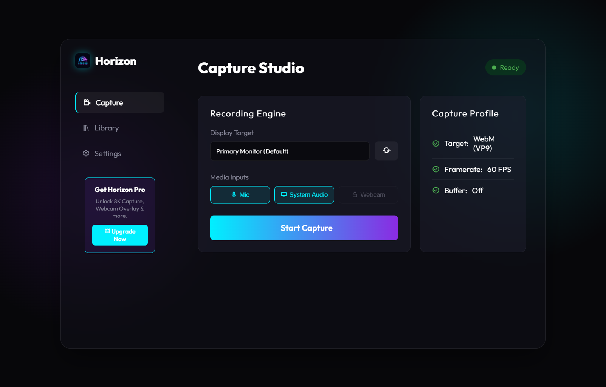
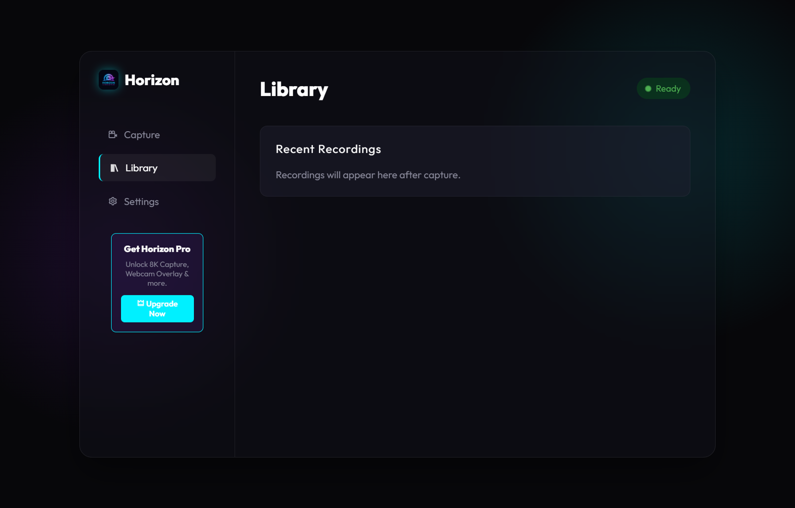
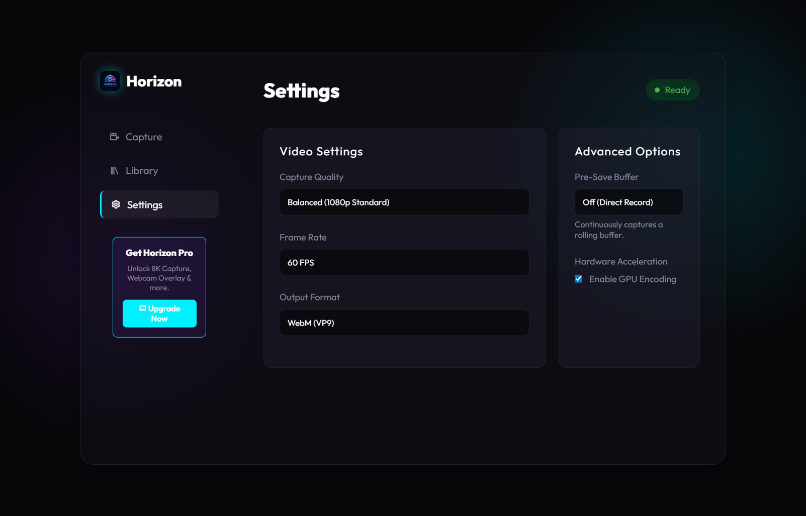

# Horizon UltraCapture (Free Version)

Welcome to the public source repository for Horizon UltraCapture. This codebase represents the free, community-preview version of the software.

## 🌐 Official Website
Check out the official HorizonUC website: [horizonuc.unaux.com](http://horizonuc.unaux.com)

## 📸 App Previews

**Capture View**

**Library View**

**Settings View**

 cc1a7c0 (Added official website link to README)

### ⚠️ Copyright & Trademark Notice

**All Source Code, UI Designs, and Logic:**
Copyright (c) 2026 Pegasus AI Corporate LLC. All Rights Reserved. This is proprietary software powered and owned by Pegasus AI Corporate LLC. You are welcome to review the code and run it locally, but you may not redistribute, modify, or use the source code for commercial purposes.

**Logos and Branding:**
The "Horizon" brand, the "Pegasus AI" brand, and all associated logos/icons are fiercely protected trademarks of Pegasus AI Corporate LLC. Do not reuse these visual assets.

To access 4K/8K recording, Webcam overlays, and custom targeting, please purchase a Pro license from our official website.
