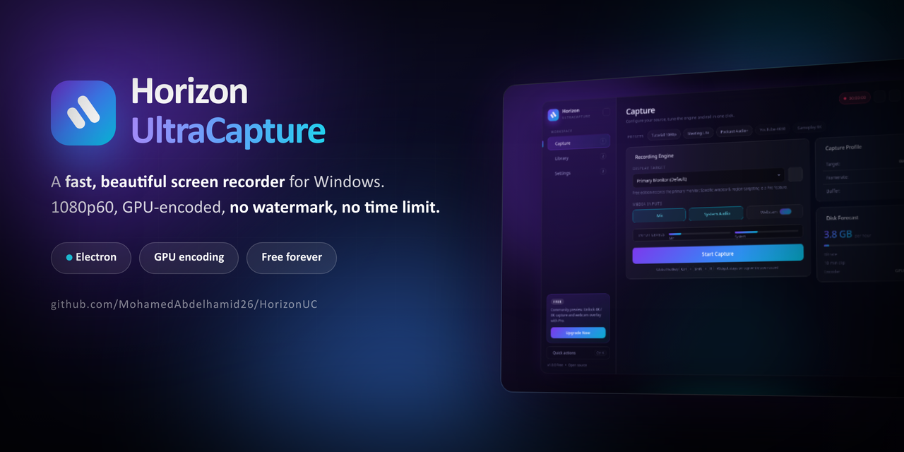

<div align="center">



<h3>Record your screen in 1080p60 with GPU acceleration.<br>No watermark. No time limit. No account.</h3>

<p>
<a href="https://horizonuc.unaux.com"><b>Website</b></a> &nbsp;&bull;&nbsp;
<a href="#download"><b>Download</b></a> &nbsp;&bull;&nbsp;
<a href="#features"><b>Features</b></a> &nbsp;&bull;&nbsp;
<a href="#build-from-source"><b>Build from source</b></a> &nbsp;&bull;&nbsp;
<a href="#free-vs-pro"><b>Free vs Pro</b></a>
</p>

<p>


</p>

<p>
<a href="https://github.com/MohamedAbdelhamid26/HorizonUC/stargazers">
</a>
<a href="https://github.com/MohamedAbdelhamid26/HorizonUC/issues">
</a>

</p>

<b>If this saved you from another watermarked trial recorder, please leave a star. It genuinely helps.</b>

</div>

---

## Why Horizon UltraCapture

Most free screen recorders make you pick a compromise: a watermark burned into your video, a 5-minute cap, a signup wall, or an interface from 2009. Horizon UltraCapture exists because none of that is necessary. Windows already gives you a hardware encoder that can capture 1080p60 with almost no CPU cost - the software just has to get out of the way and use it.

- **No watermark, no time limit, no account.** Install it, press record, get a clean file.
- **Hardware encoding.** The GPU does the work, so your game or call keeps its frame rate.
- **One-click presets.** Tutorial, meeting and podcast profiles, already tuned. No settings rabbit hole.
- **Knows your disk.** A live forecast tells you the GB per hour before you hit record, not after you run out of space.
- **Keyboard-first.** `Ctrl` + `K` opens a command palette for every action in the app.
- **Genuinely nice to look at.** Dark glass interface, five accent colours, and a reduced-motion switch for anyone who wants things still.

---

## Screenshots

**Capture** - pick a source, tune the engine and roll in one click. The disk forecast updates as you change settings.


**Library** - every take you have recorded on this machine, searchable, with preview and reveal-in-folder.


**Settings** - quality, frame rate, container, replay buffer, GPU encoding and appearance, all searchable.


---

## Download

<div align="center">

### [Download for Windows](https://www.mediafire.com/file/8sfyyol8mwfcnmf/HorizonUltraCapture_Setup_1.0.0.exe/file)

**Windows 10 / 11, 64-bit.** No account. No watermark.

</div>

Prefer to compile it yourself? See [Build from source](#build-from-source) below - it is two commands.

> Windows SmartScreen may warn you on first run because the installer is not yet code-signed with an EV certificate. Choose **More info** then **Run anyway**, or build from source if you would rather not trust a binary.

---

## Features

### Capture

| | |
| --- | --- |
| **Resolution** | 1080p, 30 or 60 FPS |
| **Containers** | WebM (VP9) and MKV (H.264) |
| **Audio** | System audio and microphone, mixed or separate toggles, with live input level meters |
| **Encoding** | GPU hardware acceleration (NVENC / QuickSync / AMF via Chromium) with a software fallback |
| **Replay buffer** | Pre-save up to 1 minute, so you can capture the thing that already happened |
| **Global hotkey** | `Ctrl` + `Shift` + `R` starts and stops from anywhere, even fullscreen |
| **Floating widget** | A small always-on-top controller stays out of your recording |
| **Countdown** | Optional 3-2-1 before capture begins |

### Presets

One click applies resolution, frame rate, container and audio routing together.

| Preset | What it sets up |
| --- | --- |
| **Tutorial 1080p** | 1080p60 WebM, mic and system audio - clean voiceover work |
| **Meeting Lite** | 1080p30, smaller files for long calls |
| **Podcast Audio+** | Audio-priority capture with both inputs live |
| **YouTube 4K60** | Pro |
| **Gameplay 8K** | Pro |

### Disk forecast

Before you record, the Capture view shows the estimated **GB per hour**, the target **bitrate**, and the size of a **10-minute clip** for your exact combination of quality, frame rate, container and GPU setting. Change any setting and the numbers move immediately.

### Library

Every recording made on the machine, newest first, with search, list or grid layout, in-app preview, reveal in folder and delete.

### Quality of life

- Command palette on `Ctrl` + `K` for every action
- Shortcut sheet on `?`
- Session timer and toast notifications
- Searchable settings
- Collapsible sidebar
- Five accent colours: violet, azure, cyan, ember, mint
- Reduced-motion toggle that disables every animation

---

## Build from source

**Prerequisites:** [Node.js](https://nodejs.org/) (includes npm) and Windows 10 or 11.

```bash
git clone https://github.com/MohamedAbdelhamid26/HorizonUC.git
cd HorizonUC
npm install      # Electron + electron-builder
npm start        # run in development
npm run dist     # build the Windows installer into dist2/
```

Windows users can double-click **`build.bat`**, which runs the same steps. The installer and portable build land in **`dist2/`**.

> **Note:** Rust is not required. `dxgi_capture_poc.rs` is a standalone proof-of-concept for a future native capture backend; it is not part of the Electron build and there is no `Cargo.toml` in this repository.

---

## Keyboard shortcuts

| Shortcut | Action |
| --- | --- |
| `Ctrl` + `Shift` + `R` | Start / stop recording (global, works while fullscreen) |
| `Ctrl` + `K` | Command palette |
| `?` | Shortcut sheet |
| `Esc` | Close palette or overlay |

---

## Free vs Pro

This repository is the **free edition**, and it is a complete screen recorder - not a crippled demo. The limits below are enforced honestly in the code: locked controls are visibly marked rather than silently ignored.

| Capability | Free (this repo) | Pro |
| --- | --- | --- |
| Capture resolution | 1080p | 1080p, 4K, 8K native |
| Frame rate | 30 / 60 FPS | 30 / 60 FPS |
| Output format | WebM (VP9), MKV (H.264) | WebM (VP9), MKV (H.264) |
| Watermark | None | None |
| Recording length | Unlimited | Unlimited |
| System audio + microphone | Yes | Yes |
| GPU-accelerated encoding | Yes | Yes, prioritised |
| Replay buffer | Up to 1 minute | Up to 1 minute |
| Webcam overlay / picture-in-picture | Locked | Device and corner selection |
| Window and region targeting | Primary monitor only | Any window or region |
| Licence activation screen | Not included | Yes |

Pro licences are available from the [official website](https://horizonuc.unaux.com). The free edition never expires and never nags mid-recording.

---

## Project layout

| File | Purpose |
| --- | --- |
| `main.js` | Electron main process - windows, tray, global hotkey, IPC, file output |
| `app.js` | Renderer logic - capture pipeline, settings state, library |
| `enhance.js` | Additive UI/UX layer (presets, palette, forecast, shortcuts). Touches no capture logic |
| `index.html` | Application shell and all views |
| `styles.css` | Design system and theming tokens |
| `widget.html` | Floating always-on-top recording widget |
| `build/` | Installer icons (`icon.png`, `icon.ico`) |
| `github_screenshots/` | Images used by this README |
| `dxgi_capture_poc.rs` | Experimental native DXGI capture proof-of-concept (not built) |

---

## Roadmap

- [x] Redesigned interface with brand palette and Inter typeface
- [x] Live disk and bitrate forecasting
- [x] Capture presets and command palette
- [x] Working `package.json` so the repo builds out of the box
- [ ] Region and single-window capture in the free edition
- [ ] Native DXGI capture backend (see `dxgi_capture_poc.rs`)
- [ ] Built-in trim and export
- [ ] macOS and Linux builds

Want something moved up the list? [Open an issue](https://github.com/MohamedAbdelhamid26/HorizonUC/issues) - requests with the most reactions get built first.

---

## FAQ

<details>
<summary><b>Is there really no watermark or time limit?</b></summary>
<br>
Correct. The free edition records for as long as your disk allows and never brands your video. The Pro limits are about resolution, webcam overlay and window targeting - never about spoiling your output.
</details>

<details>
<summary><b>Why is my recording a .webm file?</b></summary>
<br>
WebM (VP9) is the default because it is efficient and plays everywhere on the web. If your editor prefers H.264, switch the container to MKV in Settings.
</details>

<details>
<summary><b>Will recording slow down my game?</b></summary>
<br>
GPU-accelerated encoding is on by default, so the encode runs on dedicated hardware instead of your CPU. Turn hardware encoding off in Settings only if you hit driver issues.
</details>

<details>
<summary><b>Where do my recordings go?</b></summary>
<br>
Into your Videos folder, and every file is listed in the Library view where you can preview it or reveal it in Explorer.
</details>

<details>
<summary><b>Does it work on macOS or Linux?</b></summary>
<br>
Not yet. The capture pipeline and installer target Windows 10 and 11 today. Cross-platform builds are on the roadmap.
</details>

<details>
<summary><b>Why is app.js minified?</b></summary>
<br>
The shipped renderer bundle is obfuscated to protect the licensing logic. The UI layer (`index.html`, `styles.css`, `enhance.js`) and the Electron main process (`main.js`) are readable, so you can inspect and modify how the app looks and behaves.
</details>

---

## Contributing and feedback

Bug reports and feature requests are very welcome:

- **Something broken?** [Open an issue](https://github.com/MohamedAbdelhamid26/HorizonUC/issues) with your Windows version, GPU, and the settings you used.
- **Missing a feature?** Open an issue and describe the workflow you want.
- **Just enjoying it?** A star is the single most useful thing you can do - it is how other people find the project.

Please read the licence note below before opening a pull request, since this is source-available rather than open-source software.

---

## Licence, copyright and trademark

**Source code, UI designs and logic:** Copyright (c) 2026 Pegasus AI Corporate LLC. All rights reserved.

This is proprietary, **source-available** software owned by Pegasus AI Corporate LLC. You are welcome to read the code, build it and run it locally. You may **not** redistribute it, publish modified versions, or use the source for commercial purposes.

**Logos and branding:** the "Horizon" and "Pegasus AI" names and all associated logos and icons are trademarks of Pegasus AI Corporate LLC. Please do not reuse these visual assets.

<div align="center">
<br>
<b>Built by Pegasus AI Corporate LLC</b><br>
<a href="https://horizonuc.unaux.com">horizonuc.unaux.com</a>
<br><br>
<a href="https://github.com/MohamedAbdelhamid26/HorizonUC/stargazers">Star this repo</a> if it was useful to you.
</div>
